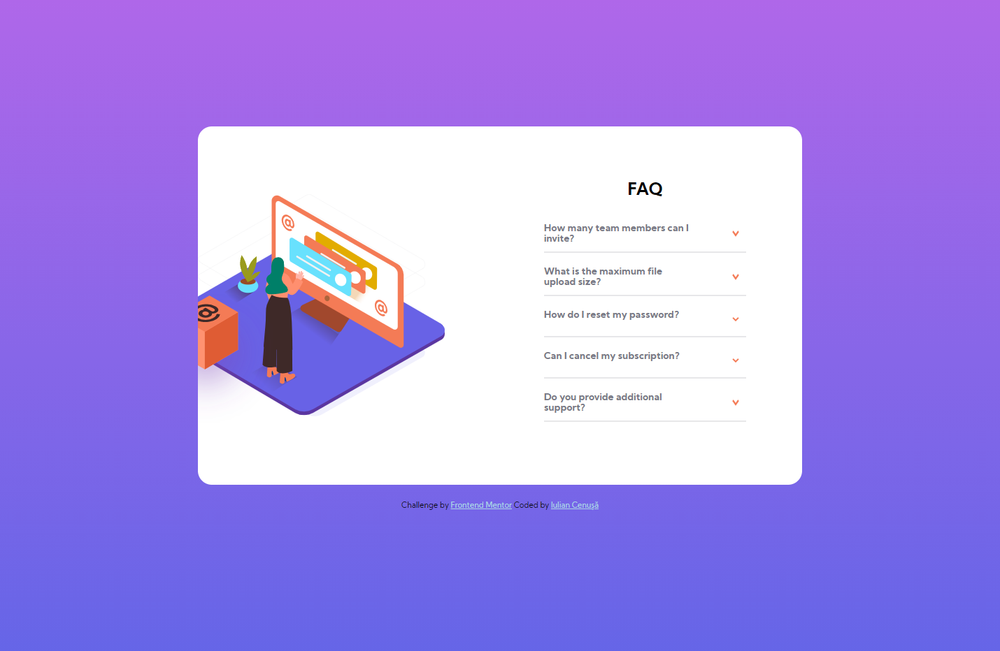

# Frontend Mentor - FAQ accordion card solution

This is a solution to the [FAQ accordion card challenge on Frontend Mentor](https://www.frontendmentor.io/challenges/faq-accordion-card-XlyjD0Oam). Frontend Mentor challenges help you improve your coding skills by building realistic projects. 

## Table of contents

- [Overview](#overview)
  - [The challenge](#the-challenge)
  - [Screenshot](#screenshot)
  - [Links](#links)
- [My process](#my-process)
  - [Built with](#built-with)
  - [What I learned](#what-i-learned)
  - [Continued development](#continued-development)
  - [Useful resources](#useful-resources)
- [Author](#author)

## Overview

### The challenge

Users should be able to:

- View the optimal layout for the component depending on their device's screen size
- See hover states for all interactive elements on the page
- Hide/Show the answer to a question when the question is clicked

### Screenshot



### Links

- Solution URL: [GitHub](https://github.com/iulian-cenusa/frontend-mentor-faq-accordion-card)
- Live Site URL: [GitHub Pages](https://iulian-cenusa.github.io/frontend-mentor-faq-accordion-card/)

## My process

### Built with

- CSS custom properties
- Flexbox
- CSS Grid
- Desktop-first workflow

### What I learned

- improved CSS Gradient knoledge
- learned how to make an accordion using only CSS and no JavaScript

You can see below some snippets regarding this acomplishment:

```html
      <div class="question_element">
        <input type="checkbox" id="title2" />
        <label for="title2">
          <div class="question_header">
            <h3 class="question">What is the maximum file upload size?</h3>
            
          </div>
        </label>
        <p class="answer">No more than 2GB. All files in your account must fit your allotted storage space.</p>
        <hr>
      </div>
```
```css
input{
    display: none;
}

input + label + .answer {
    display: none;
}

input:checked + label + .answer {
    display: block;
}

input:checked + label img{
    transform: rotate(180deg);
}
```

### Continued development

This project can be further improved in order to look like the images from the challenge.

What should be done:
- FAQ title does not align to the left on large screens even if the content below is.
- Box illustration image is not align well to the other image on large screens.
- On mobile screen size there is a big gap between image on the top and the content below.


### Useful resources

- [Pure CSS Acordion](https://supfort.com/demo/pure-css-accordion-no-javascript/) - This helped me creating acordion elements without using JavaScript.

## Author

- Frontend Mentor - [@iulian-cenusa](https://www.frontendmentor.io/profile/iulian-cenusa)
- Twitter - [@IulianCenusa](https://twitter.com/IulianCenusa)
- Other Projects - [Bitbucket Repo](https://bitbucket.org/iulian_cenusa/)

